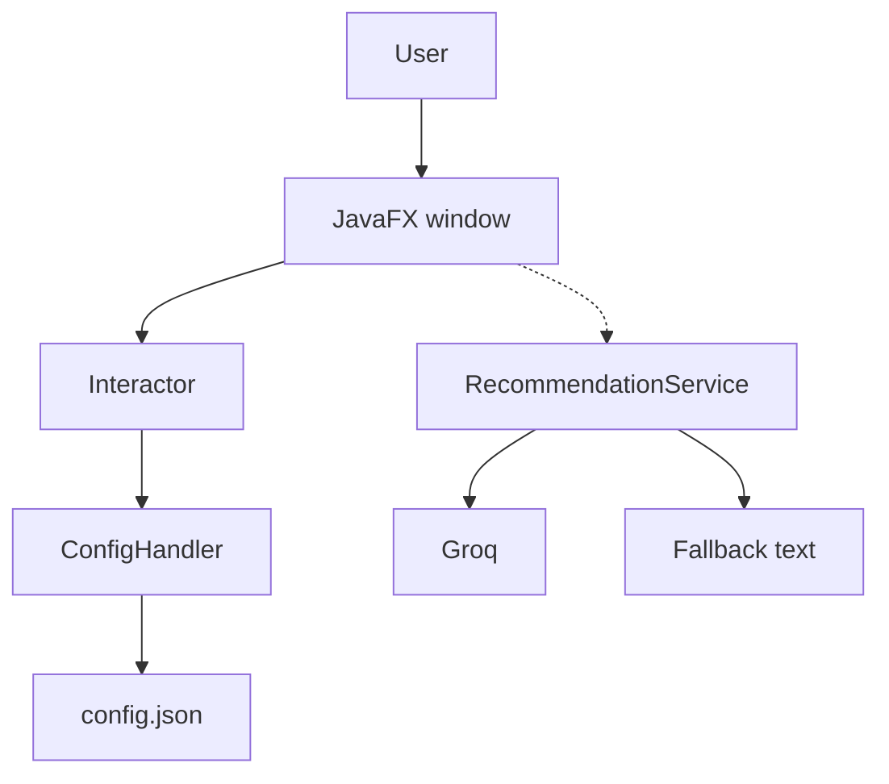

# Break Time Buddy — Architecture (Alpha)

JavaFX desktop app. Tracks work sessions and recommends a short break.

## What exists now

- Java 17 + JavaFX + Maven, CI on `develop`
- Session toggle and session count
- `config.json` for the saved count
- Null/empty/negative counts become 0 on load
- Recommendation service: Groq if `GROQ_API_KEY` is set, otherwise a rule-based fallback

Some of this is still landing through open PRs.

## How the pieces connect

```
User
  -> JavaFX window
    -> Interactor (session on/off + count)
      -> ConfigHandler -> config.json
    -> RecommendationService   [not on the window yet]
      -> Groq, or fallback text
```

Toggle work on, toggle off, count goes up, count can save/load. A recommendation is a short sentence from Groq or from the fallback.



## Data

Now:
- in session or not
- session count
- saved count in config.json
- recommendation text

Later:
- session duration
- break preferences
- recent break history
- companion mood

## Roles

- Lead Architect — system map and module boundaries
- Session / UI / config — window, toggle, saved count
- AI / integration — Groq, fallback, AI tests

## Alpha bar

- window runs
- session count save/load works
- recommendation returns a short string
- CI stays green

