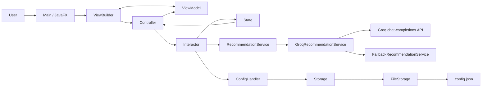

# Break Time Buddy — System Architecture

## Overview

Break Time Buddy is a Java 17 and JavaFX desktop application for managing work and break sessions and providing short break recommendations. Its design separates presentation, controller/application coordination, session and domain logic, persistence, and recommendation/AI integration.

This document is intended for developers and technical stakeholders who need to understand, maintain, review, or extend Break Time Buddy.

- The presentation layer builds the JavaFX interface and exposes observable UI state.
- The controller coordinates user actions and state updates between the interface and application logic.
- The interactor owns session behavior, history, configuration coordination, and recommendation-request state.
- The persistence layer serializes supported local data through an abstract storage interface.
- The recommendation layer selects between the Groq integration and a local rule-based fallback.

## High-Level Architecture


```mermaid
flowchart LR
  User[User] --> Main[Main / JavaFX]
  Main --> View[ViewBuilder]
  View <--> VM[ViewModel]
  View --> Controller
  Controller --> Interactor
  Interactor --> State
  State --> Controller
  Controller --> VM

  Interactor --> Rec[RecommendationService]
  Rec --> GroqService[GroqRecommendationService]
  GroqService --> GroqAPI[Groq chat-completions API]
  GroqService --> Fallback[FallbackRecommendationService]

  Interactor --> ConfigHandler
  ConfigHandler --> Storage
  Storage --> FileStorage
  FileStorage --> ConfigFile[config.json]
```

`Main` assembles the production application with a `Controller`, `ConfigHandler`, and `FileStorage` targeting `config.json`. The controller constructs the `ViewModel`, `Interactor`, and `ViewBuilder`. The interactor publishes immutable `State` snapshots that the controller transfers into the observable view model. Recommendation requests pass through `RecommendationService`; configuration operations pass through `ConfigHandler` and `Storage`.

## Presentation Layer

### Main

`Main` is the JavaFX `Application` entry point. It creates a 400 × 300 scene, assigns the title **Break Time Buddy**, installs the controller-provided view, and displays the primary stage. `App` provides the Maven-configured `main` entry point and delegates to `Main.main(...)`.

### ViewBuilder

`ViewBuilder` constructs the JavaFX control tree and binds it to the `ViewModel`. The interface includes:

- A work-session toggle showing **In session** or **Not in session**.
- A completed-session count.
- An editable preferred-work-length spinner.
- Recent completed work and break history.
- Pending-recommendation status and a manual recommendation-request button.
- A recommendation display with **Start Break** and **Not Now** actions.
- Configuration save/load controls and timestamped feedback.

The builder receives action callbacks rather than invoking domain operations directly. JavaFX bindings keep labels, history, preference values, pending state, recommendation display, and feedback synchronized with view-model properties.

### ViewModel and State

`ViewModel` exposes JavaFX properties for the current session state, status text, completed-session count, preferred work duration, history, recommendation-request status, dialog state, and configuration feedback. It also converts the preferred duration to and from whole minutes for the UI.

`State` is the interactor's immutable snapshot containing:

- `inSession`
- `sessions`
- `preferredWorkLength`
- `history`
- `breakRecommendationRequested`
- `dialogState`

This separation keeps JavaFX-specific observable properties out of the interactor.

## Controller / Application Coordination

`Controller` connects UI callbacks from `ViewBuilder` to `Interactor` operations and transfers each published `State` into the `ViewModel`. It also forwards preferred-work-length changes from the view model to the interactor.

State notifications may originate from asynchronous recommendation completion. When a notification arrives, the controller checks `Platform.isFxApplicationThread()`. Updates already on the JavaFX Application Thread are applied directly; other updates are scheduled with `Platform.runLater(...)`.

The public production constructor accepts a `ConfigHandler` and creates a `GroqRecommendationService`. A package-visible constructor accepts both `ConfigHandler` and `RecommendationService`, allowing tests to substitute recommendation behavior without contacting an external provider.

Configuration save and load operations are currently synchronous. The controller catches failures and exposes timestamped **Save success**, **Load success**, **Save error: ...**, or **Load error: ...** feedback through the view model.

## Interactor

`Interactor` owns the application's session and recommendation workflow. Its responsibilities include:

- Tracking whether a work session is active.
- Counting completed work sessions.
- Maintaining the preferred work duration.
- Recording the 20 most recently completed work and break entries in newest-first order.
- Coordinating save and load operations through `ConfigHandler`.
- Creating contextual recommendation requests during an active work session.
- Handling asynchronous recommendation completion.
- Accepting or rejecting the currently displayed recommendation.

Toggling from work to break increments the completed-work-session count, closes and records the work history entry, and begins a break entry. Toggling back closes and records the break entry and begins another work entry. When history already contains 20 items, completing another entry removes the oldest item.

`RecommendationRequest` contains:

- `sessions`: completed work-session count.
- `preferredWorkLength`: configured preferred duration.
- `workingDuration`: elapsed time in the active work session.
- `history`: a snapshot of recent completed work and break entries.

Recommendation requests are ignored when no work session is active. An `AtomicBoolean` prevents a second request while one is pending. The interactor retains the current `CompletableFuture<RecommendationResponse>` and compares it by identity during completion, preventing a stale result from replacing newer state. Leaving the active work session clears displayed recommendation state and cancels the current request. A response becomes visible only when the future is still current, it completed without error, the work session remains active, and `shouldBreak` is `true`. When `shouldBreak` is `false`, the pending state is cleared and no recommendation dialog is displayed.

Each displayed recommendation receives a UUID. The interactor compares the ID supplied by an accept or reject action with the ID of the currently displayed dialog state and ignores a nonmatching ID. This ensures that actions apply only while the supplied ID matches the current dialog state, preventing actions associated with an outdated dialog from changing current state during asynchronous recommendation processing. Accepting the current recommendation switches an active work session to a break; rejecting it dismisses the recommendation without changing the session.

## Recommendation / AI Layer

### RecommendationService Contract

`RecommendationService` abstracts recommendation generation with the current contract:

```java
CompletableFuture<RecommendationResponse> getRecommendation(RecommendationRequest request);
```

The asynchronous contract allows the interactor to publish pending state while a provider request is in progress. `GroqRecommendationService` is the production implementation, and `FallbackRecommendationService` supplies deterministic local recommendations.

`RecommendationResponse` is an immutable record with two fields:

- `shouldBreak`: whether the service recommends taking a break.
- `activity`: the recommended break activity when `shouldBreak` is `true`.

A false `shouldBreak` value represents a valid no-break response. A true value carries the activity that the interactor can expose in the recommendation dialog.

### GroqRecommendationService

`GroqRecommendationService` reads `GROQ_API_KEY` from the process environment. If the value is absent or blank, it immediately delegates to the fallback service. Otherwise, it sends an HTTP POST request to the Groq chat-completions endpoint at `https://api.groq.com/openai/v1/chat/completions` using the model `qwen/qwen3.8-27b`.

The HTTP request has a 10-second timeout. `DefaultGroqHttpClient` also constructs its Java HTTP client with a 10-second connection timeout and performs the request asynchronously.

Provider reliability behavior is bounded:

- At most three attempts are made.
- Retries wait one second.
- HTTP `429` responses and status codes `500` or higher are retried while attempts remain.
- Asynchronous or network failures are retried while attempts remain.
- Other non-success HTTP responses use the fallback without retry.
- Exhausted retries use the fallback.

The request asks Groq for a JSON-schema response named `breakRecommendation`. The schema describes an object with a required Boolean `shouldBreak` property and an `activity` string property, disallows additional properties, and uses non-strict schema mode. The service extracts `choices[0].message.content` and parses that content as the structured object before converting it to `RecommendationResponse`.

A response with `shouldBreak` set to `false` is accepted as a no-break response, and its activity is normalized to an empty string. If `shouldBreak` is `true`, `activity` must be present and non-null; it is trimmed and must remain nonblank. The activity must not contain `<think>` or `</think>` tags, must not contain any defined medical-advice term, and must contain no more than 30 whitespace-delimited words. Missing content, malformed JSON, an invalid structured response, or an invalid break activity causes the service to use the fallback.

The medical-advice filter lowercases the activity and rejects it if it contains any of these defined strings: `ibuprofen`, `aspirin`, `acetaminophen`, `medication`, `medicine`, `dosage`, `dose`, `diagnose`, `diagnosis`, `treatment`, `prescription`, `prescribe`, `take a pain reliever`, `take pain reliever`, `stop taking`, or `start taking`. This is a limited string-based validation layer, not a comprehensive medical-safety system.

The Groq prompt includes completed work-session count, preferred work duration, current continuous work duration, and the phase and duration of recent completed work and break sessions. When history is empty, the prompt states that the user has not completed any sessions. It asks Groq to decide whether the user should take a break and, only if so, recommend one short, healthy break activity under 30 words without medical advice.

## Fallback Recommendation

`FallbackRecommendationService` does not call Groq and returns an already-completed `CompletableFuture<RecommendationResponse>`. It sets `shouldBreak` to `true` only when `workingDuration` is strictly greater than 80% of `preferredWorkLength`. At exactly 80%, or below that threshold, it returns `shouldBreak` as `false` with an empty activity.

When the threshold is exceeded, it selects a fixed activity from the completed work-session count:

- Four or more sessions: a 10-minute break with walking, stretching, and water.
- Two or three sessions: a 5-minute break and stretching.
- Zero or one session: a short break to rest the eyes.

This fallback is used when no Groq credential is configured and when the Groq integration cannot produce a valid response. Because the fallback applies its duration threshold in every case, fallback use does not necessarily produce a recommendation dialog.

## Persistence

The persistence path is:

```text
Interactor -> ConfigHandler -> Storage -> FileStorage -> config.json
```

`Interactor.saveConfig()` creates a `ConfigData` record containing the completed-work-session count, preferred work duration, and completed history entries. Each persisted history entry contains a phase, begin timestamp, and end timestamp. Active, incomplete work or break entries are not included.

`ConfigHandler` uses Gson for JSON serialization and deserialization and reads and writes UTF-8 streams. On load, it passes deserialized data through `ConfigData.sanitize(...)` before returning it to the interactor.

Sanitization provides defaults or corrections for invalid data:

- A negative session count becomes zero.
- A missing preferred duration uses the 50-minute default.
- Preferred duration is truncated to whole minutes and clamped to 1–300 minutes.
- Missing history becomes an empty list.
- History is limited to 20 entries.
- Null history entries and entries with missing or invalid timestamps are omitted.
- A missing history phase defaults to work.

`Storage` abstracts input and output streams. `FileStorage` implements that interface with buffered file streams and rejects a directory where a file is expected. `Main` configures it to use the local `config.json` path. `GROQ_API_KEY` is not part of `ConfigData` and is not stored in `config.json`.

## Data Flow

### Session and Configuration Flow

Session state follows this pipeline:

`ViewBuilder` → `Controller` → `Interactor` → (`State`) `Controller` → `ViewModel` → `ViewBuilder`

`ViewBuilder` invokes controller callbacks, the interactor applies the session operation and publishes a `State` snapshot, and the controller updates `ViewModel` on the JavaFX Application Thread when required. JavaFX bindings then update the visible controls.

Configuration persistence follows this pipeline:

`ViewBuilder` → `Controller` → `Interactor` → `ConfigHandler` → `Storage` → `FileStorage` → `config.json`

Save operations serialize through this boundary. Load operations read through the same boundary, sanitize the configuration, apply it in the interactor, and return updated state through the session-state pipeline.

### Recommendation Flow

`Controller` → `Interactor` → (`RecommendationRequest`) `RecommendationService` → (`RecommendationResponse`) `Interactor` → (`State`) `Controller` → `ViewModel` → `ViewBuilder`

The interactor creates the request during an active work session. `GroqRecommendationService` uses Groq when configured and delegates to `FallbackRecommendationService` when required. The `CompletableFuture<RecommendationResponse>` completes asynchronously, after which the interactor verifies that the result is current and the work session remains active. If `shouldBreak` is `true`, the activity enters `State` and the recommendation dialog becomes visible; if `shouldBreak` is `false`, the pending request clears and no dialog is displayed.

## Local vs External Data Boundary

Session state and configuration are maintained locally. When Groq is enabled and a recommendation is requested, the constructed prompt can include:

- Completed work-session count.
- Preferred work duration.
- Current active-work duration.
- The phase and duration of recent completed work and break entries.

The prompt represents history as phases and calculated durations; it does not include the stored begin and end timestamps themselves. Fallback operation is local and does not require Groq.

Reading `GROQ_API_KEY` from an environment variable reduces the risk of accidentally committing the credential to source control, but it should not be described as production-grade secret protection for a distributed desktop application. A backend or proxy could provide a stronger production boundary in the future, but no backend or proxy is part of the current implementation.

## Reliability and Error Handling

The current architecture includes the following verified controls:

- `ConfigData.sanitize(...)` normalizes loaded configuration and filters invalid history.
- Session history is bounded to 20 completed entries in both application state and loaded configuration.
- Atomic pending state prevents duplicate simultaneous recommendation requests.
- Future identity checks prevent stale asynchronous completions from updating the UI.
- Leaving work state clears and cancels the current recommendation request.
- HTTP connection and request operations use 10-second timeouts.
- Retry attempts are capped at three with a one-second delay.
- Provider failures and invalid responses use the local fallback, which independently decides whether its duration threshold has been exceeded.
- Structured Groq responses are converted to `RecommendationResponse`; when a break is recommended, validation requires a nonblank activity without reasoning tags or selected medical-advice terms and within the 30-word maximum.
- Configuration save/load exceptions are caught by the controller and displayed as timestamped UI feedback.

## Testing and CI

The project uses JUnit 5 tests executed by Maven. Testability is supported by several dependency boundaries:

- `RecommendationService` can be replaced with a test implementation through the controller and interactor constructors.
- `GroqHttpClient` allows HTTP behavior to be substituted in recommendation-service tests.
- `Storage` allows persistence tests to avoid the production file implementation.
- State-change callbacks allow interactor behavior to be observed without a full UI.

GitHub Actions defines a **Java CI** workflow for pushes and pull requests targeting `develop`. It runs on Ubuntu, installs Temurin Java 17, enables Maven dependency caching, and executes:

```bash
mvn -B verify
```

Final integrated local verification on October 3, 2026 recorded 77 tests, with 0 failures, 0 errors, and 0 skipped. No coverage percentage or performance benchmark is asserted.

## Architectural Limitations / Future Direction

The current system has the following architectural limitations:

- It is a desktop client that communicates directly with the external AI provider when Groq is enabled.
- The provider credential exists in the client process.
- Persistence is a local JSON file rather than a shared or transactional data service.
- Configuration file access is synchronous on the UI action path.
- There is no application backend.
- Consequently, the current application has no server-side validation, provider rate limiting, centralized logging, or centralized secret management under project control.

A future production architecture could introduce a backend or proxy for centralized request validation and sanitization, rate limiting, controlled logging, and server-side secret handling. These are possible future improvements and are not implemented in the current branch.

## Technology and Tooling

| Technology or tool | Architectural role |
| --- | --- |
| Java 17 | Language and configured compiler/runtime target |
| JavaFX | Desktop UI, observable properties, bindings, and application lifecycle |
| Maven | Dependency management, build, test, and JavaFX launch tooling |
| Gson | JSON serialization and deserialization for configuration data |
| JUnit 5 | Automated unit and integration-oriented testing framework |
| Groq API | Optional external chat-completions provider |
| GitHub Actions | Java 17 CI running `mvn -B verify` |

## Application Components

| Component | Architectural role |
| --- | --- |
| `Main` | JavaFX entry point and production composition root |
| `ViewBuilder` / `ViewModel` / `State` | UI construction, observable presentation state, and immutable application snapshots |
| `Controller` | Coordination between UI callbacks, application logic, and JavaFX-thread state updates |
| `Interactor` | Session, history, persistence coordination, and recommendation workflow |
| `RecommendationRequest` / `RecommendationResponse` | Context sent to recommendation services and the resulting break decision/activity |
| `RecommendationService` | Asynchronous recommendation abstraction |
| `GroqRecommendationService` / `GroqHttpClient` | Groq integration and replaceable HTTP boundary |
| `FallbackRecommendationService` | Local rule-based recommendation implementation |
| `ConfigHandler` / `Storage` / `FileStorage` / `config.json` | Local configuration serialization and persistence boundary |
| `CompletableFuture` | Asynchronous recommendation and HTTP-result handling |

## Team Responsibilities

- Larry Ford — Lead Architect
- Leora Greenlinger — UI/UX and Visual Design Lead
- Narumi Yokobori — Interface Designer
- Kapil Dhami — Integration Lead

## Final Release Note

This document reflects the current `develop`-branch architecture at final documentation review time.
